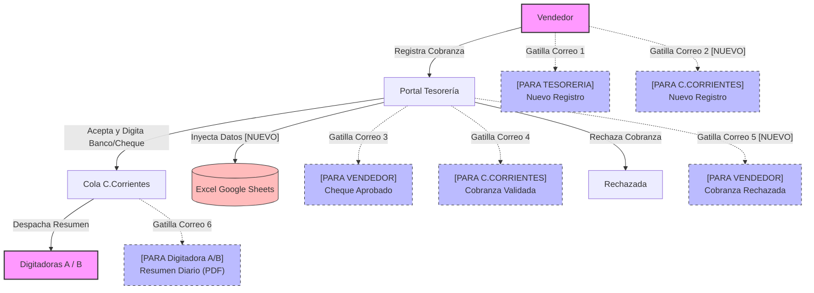

# Adaptación del Sistema a la Realidad Operativa y Flujo de Trabajo

## 1. Definición del Flujo Operativo Consolidado

A partir del análisis operativo y de las reuniones con Tesorería y Cuentas Corrientes, la cadena de custodia y despacho digital queda consolidada de la siguiente form```
[1. VENDEDOR en Terreno]
   │  * Registra cobranza en la App (1 o más cheques para 1 o más facturas/cuotas por cliente).
   │  * Adjunta comprobante de despacho (Chilexpress u OT presencial).
   │  * Estado Inicial: PENDIENTE_ENVIO / EN_TRANSITO.
   ▼
[2. TESORERÍA (Validación Física en Mano)]
   │  * Recibe sobre físico y verifica el cheque en mano contra la pantalla.
   │  * Opciones:
   │    a) ACEPTAR Y VALIDAR: Clic en "✓ Validar - Enviar Cuentas Corrientes". 
   │       -> Pasa a RECIBIDO_TESORERIA. Se notifica al vendedor por correo. Queda en cola de C.Corr.
   │    b) RECHAZAR: Clic en "Rechazar" con motivo obligatorio.
   │       -> Pasa a RECHAZADO. Notificación inmediata al vendedor con el motivo y registro en historial.
   ▼
[3. GERENCIA DE CUENTAS CORRIENTES (Liberación, Auditoría y Control de Hora)]
   │  * Accede a su portal exclusivo (`admin/cuentas_corrientes.php`).
   │  * Administra la hora de despacho diario y la matriz de digitadoras (licencias/reemplazos).
   │  * A la hora de corte (o clic en "⚡ Despachar Resumen Ahora"):
   │    -> Agrupa los cheques validados por empresa y despacha el correo HTML limpio a cada digitadora (con CC a la Supervisora).
   │    -> Actualiza el estado final de las cobranzas a DEPOSITADO / INGRESADO_OPTIMUS.
   │    -> Registra auditoría indeleble en `log_envios_informes` e `historial_estados` para garantizar consistencia.
   ▼
[4. DIGITADORAS DE CUENTAS CORRIENTES]
   │  * Reciben el correo consolidado por empresa a la hora de liberación.
   │  * Tipean la información limpia en Optimus ERP cuando se liberan de su cola cotidiana.
```

---

## 2. Reglas del Resumen Diario y Gestión de Digitadoras

### A. Simulación de Digitadoras en Entorno de Pruebas
Para la fase de desarrollo actual, se utilizan direcciones simuladas configuradas en la tabla `empresas`:

| ID | Empresa | BD ERP | Correo Digitadora Simulada |
|----|---------|--------|----------------------------|
| 1 | Automarco LTDA | `automarc_automarco` | `digitadora1@app.local` |
| 2 | HD Automarco S.A | `autohd_automarcohd` | `digitadora2@app.local` |
| 3 | Autotec S.A | `autotec_ecom` | `digitadora3@app.local` |
| 4 | Gabtec S.A | `gabteccl_sitbdd1978` | `digitadora4@app.local` |

> *Nota:* La cantidad final de digitadoras y sus correos institucionales reales se parametrizarán en Producción tras confirmar la estructura con la Supervisora.

### B. Rol de la Supervisora de Cuentas Corrientes
- **Aviso en Tiempo Real:** La supervisora recibe notificación cuando Tesorería valida un cheque.
- **Supervisión Consolidada:** A las 16:00 hrs (o según horario configurado), la supervisora recibe copia (CC) de los resúmenes enviados a las digitadoras para controlar la carga de trabajo diaria.
- **Liberación y Re-envíos:** Cuenta con acceso a su portal dedicado (`admin/cuentas_corrientes.php`) para liberar lotes acumulados, gestionar licencias médicas o re-despachar informes fallidos.

### C. Formato del Correo: HTML Limpio
- Estructura limpia y responsiva en HTML (sin adjuntos).
- Contenido: Empresa, Cliente (RUT y Razón Social), Vendedor, Detalle de Cheques (Banco, N° Cheque, Monto, Vencimiento) y Facturas/Cuotas Abonadas.
- Incluye enlace directo a la vista del Portal Admin (`admin/index.php?id=XXX`).

### D. Garantía de No Pérdida de Cheques (Tabla `log_envios_informes`)
Para evitar que se traspapele o se pierda información si se cae el servidor o falla el servidor de correo (SMTP):
- Toda notificación enviada (individual o resumen diario) se registra en la tabla **`log_envios_informes`**.
- Si el envío falla por caída de red/servidor, el sistema registra el evento con estado **`FALLIDO`** y el motivo exacto del error.
- En el Portal de Cuentas Corrientes se disponibiliza una vista de auditoría para la Supervisora que permite **re-intentar o re-enviar** cualquier informe fallido con 1 clic, asegurando que **cero cheques o facturas se pierdan**.

### E. Portal Exclusivo de Cuentas Corrientes
- La Supervisora de Cuentas Corrientes cuenta con su propio portal exclusivo (`admin/cuentas_corrientes.php`).
- Al iniciar sesión con su cuenta (`cuentascorrientes@automarco.cl`), es redirigida directamente a su consola gerencial para gestionar la distribución de cheques a sus digitadoras.

---

## 3. Hoja de Ruta de Desarrollo Backend

- [x] **Configurar correos por empresa en BD:** Tabla `empresas` almacena el email de la digitadora de cada razón social.
- [x] **Tabla de Bitácora de Envíos (`log_envios_informes`):** Tabla creada y validada en el esquema base para auditoría de notificaciones.
- [x] **Crear Script del Resumen Diario (`cron/resumen_diario_cuentas_corrientes.php`):** Script CLI/PHP con sincronización de Timezone (Chile) e Idempotencia por base de datos para evitar duplicados.
- [x] **Copias a Supervisora y Reintentos:** Incluido el parámetro `CC` para la supervisora y botón de reenvío en la UI.
- [x] **Portal Gerencial Dedicado (`admin/cuentas_corrientes.php`):** Interfaz completa para control de hora de corte, matriz de licencias/reemplazos, despacho manual y auditoría.
- [ ] **Programador de Tareas (Cron Job / Windows Task Scheduler):** Configurar la ejecución automática en el servidor de producción.

---

## 4. Análisis Crítico de Puntos de Falla (Brechas del Flujo) y Roadmap de Soluciones

Tras un análisis profundo del flujo actual (Vendedor -> Tesorería -> Cuentas Corrientes), se han identificado los siguientes posibles puntos de falla operativos y técnicos, junto a sus soluciones propuestas para el roadmap futuro:

### Falla 1: Falsos Positivos en "INGRESADO_OPTIMUS" (El Rebote del ERP)
* **Problema:** Cuando Cuentas Corrientes (CC) "despacha/libera" un lote de cheques a las digitadoras, el estado del cheque pasa a `DEPOSITADO` (o `INGRESADO_OPTIMUS`). Sin embargo, en ese momento la digitadora *recién* va a tipear el cheque en el ERP. ¿Qué pasa si al ingresarlo en Optimus el cheque es rechazado (ej. factura ya estaba pagada, cuenta corriente bloqueada, error de sistema)? El sistema de cobranzas registrará un "Falso Positivo" de éxito, dejando al cheque en un limbo (físicamente rechazado, pero digitalmente "exitoso").
* **Solución (Roadmap):** 
  - Crear un nuevo estado temporal llamado `EN_PROCESO_DIGITACION` al momento del despacho.
  - Añadir un micro-módulo (o respuesta rápida de enlace en el correo) para que la digitadora confirme el éxito (`INGRESADO_OPTIMUS`) o reporte un rebote (`RECHAZADO_ERP`), lo cual notificaría en reversa a Tesorería y al Vendedor para devolver el cheque físico.

### Falla 2: Dependencia Absoluta del Correo Electrónico
* **Problema:** El sistema asume que la digitadora siempre recibe y lee el correo. Si el proveedor SMTP falla (aunque se pueda reintentar), o el correo se va a SPAM, o la digitadora borra accidentalmente el mensaje, el flujo se detiene y la digitadora queda sin ese trabajo visible.
* **Solución (Roadmap):**
  - **Portal de Digitadoras (Dashboard de Solo-Lectura):** Crear una vista donde la digitadora ingresa y ve su "Cola de Trabajo Actual" en vivo, independiente de si le llegó el correo o no. El correo pasa a ser un simple aviso (Push Notification), pero la fuente de la verdad para el trabajo diario reside en la base de datos (Portal).

### Falla 3: Errores de Tipeo vs Físico (Validación Humana)
* **Problema:** El Vendedor tipea el N° de Cheque y Monto en terreno. Tesorería mira la pantalla y el cheque físico, y le da "Aprobar". La fatiga visual puede hacer que Tesorería apruebe un cheque con un error de tipeo sutil (ej. $1.000.000 vs $10.000.000, o que falte una firma). Si pasa a CC, la digitadora intentará ingresar el dato erróneo al ERP.
* **Solución (Roadmap):**
  - **Doble Validación a Ciega (Tesorería):** Obligar a Tesorería a re-tipear campos críticos (como el Monto o N° de Cheque) al momento de validar. Si el monto que ingresa Tesorería no coincide con el del Vendedor, lanza una alerta.
  - **Evidencia Fotográfica Inmutable:** Requerir que el vendedor suba una foto clara del cheque físico en el paso 1. Así, CC y Tesorería pueden validar visualmente si hay discrepancias sin necesidad del físico en la mano.

### Falla 4: Concurrencia y Carrera de Datos (Race Conditions)
* **Problema:** Si el Cronjob (automático) se ejecuta a las 16:00:00 exactamente al mismo milisegundo en que la Supervisora de CC hace clic manual en "Despachar Resumen", o al mismo tiempo que Tesorería está aprobando un nuevo cheque, podrían duplicarse los correos, saltarse estados o procesar cheques a medias.
* **Solución (Roadmap):**
  - Implementar **Bloqueos Transaccionales de Base de Datos (`SELECT ... FOR UPDATE`)** en las sentencias PDO durante el despacho, garantizando que un lote de cheques en estado `RECIBIDO_TESORERIA` solo pueda ser tomado por un proceso (Cron o UI) a la vez de forma atómica.

---

## 5. Próxima Iteración de Flujo (Flujo de Correos y Excel de Tesorería)

Para completar el ciclo operativo del negocio, se ha diseñado la siguiente ampliación del flujo de notificaciones y automatización con la planilla interna:

### A. Nuevos Disparadores y Destinos de Correo
1. **Registro Vendedor:** Al guardar una cobranza desde la App, se gatillarán **dos correos independientes**:
   - Uno a Tesorería: `[PARA TESORERIA] Registro de Cobranza...`
   - Otro a Cuentas Corrientes: `[PARA C.CORRIENTES] [NUEVO REGISTRO] Registro de Cobranza...` (Permitiéndoles monitorear ingresos preventivamente).
2. **Rechazo en Tesorería:** Si Tesorería decide rechazar una cobranza física, se gatillará un correo inmediato de notificación de rechazo al Vendedor:
   - **Destinatario:** Vendedor de la cobranza.
   - **Asunto:** `[PARA VENDEDOR] [CHEQUE RECHAZADO] Cobranza N° XXX` (Incluirá el motivo obligatorio ingresado por Tesorería).

### B. Integración con Planilla Excel de Tesorería (Google Sheets API) - [COMPLETADO]
- **Estado:** ✅ Totalmente Operativo.
- **Detalle de Implementación:** Se implementó el servicio nativo [GoogleSheetsService.php](file:///c:/laragon/www/form/services/GoogleSheetsService.php) que utiliza autenticación OAuth2 JWT firmada localmente mediante `openssl_sign` y cURL sin requerir dependencias externas. 
- **Acción:** Al momento de transicionar el estado a `RECIBIDO_TESORERIA` (cuando Tesorería ya completó el Banco y N° de Cheque físicos), el sistema invoca automáticamente a la API de Google Sheets y agrega los cheques validados en filas nuevas en el Excel corporativo configurado (`1dv0St5yPOwIiOLaOb3Q2SqHFkJ57l3esmHVRIrZlV2o`).
- **Mapeo de Datos:** Las columnas ingresadas son:
  1. *Fecha*: Vencimiento del cheque.
  2. *Nombre girador*: Razón social de la empresa destino (`emitido_a`).
  3. *Monto*: Monto cobrado.
  4. *Rut cliente*: Identificación del cliente.
  5. *nRecibo*: N° de cheque físico.
  6. *Nombre cliente*: Razón social del cliente.
  7. *Fecha ingreso*: Fecha y hora de validación en Tesorería.
  8. *CTANUMERO*: Banco emisor.
  9. *comentario*: Comentarios/notas adicionales.
- **Tolerancia a fallos:** El disparo se ejecuta después del commit SQL de la base de datos local de manera asíncrona/segura para prevenir que un fallo o timeout de la API de Google bloquee la validación de Tesorería.

### C. Diagrama Mermaid Planificado



