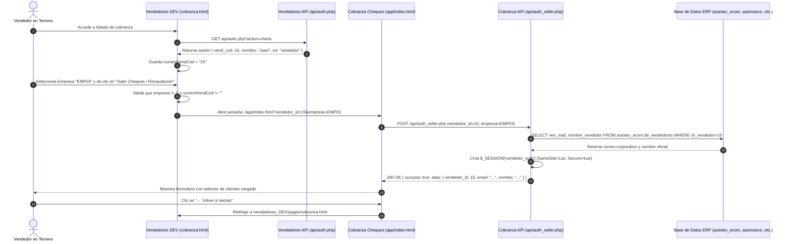

# Bitácora Técnica de Integración y Cambios: Vendedores Web ↔ Cobranza de Cheques

Este documento contiene el **registro exhaustivo y detallado** de todos los cambios, archivos modificados, variables creadas, lógica de negocio y arquitectura implementada para enlazar la aplicación **Vendedores Web (DEV)** con el **Módulo de Cobranza de Cheques (App)**.

---

## 1. Arquitectura y Estructura en Servidor de Producción

En el servidor productivo (`www.autotec.cl`), los módulos se encuentran estructurados bajo la raíz de cobranzas de la siguiente manera:

```text
/var/www/html/autotec/cobranza_cheques/
│
├── app/                                  # Módulo Principal de Cobranza de Cheques (Formulario y Tesorería)
│   ├── .htaccess                         # Configuración Apache, HSTS, CSP y Variables SetEnv
│   ├── index.html                        # Interfaz de captura de cheques y comprobantes (Vendedor)
│   ├── script.js                         # Lógica JavaScript de cheques, validación y envío
│   ├── styles.css                        # Estilos CSS del módulo de cheques
│   ├── config/
│   │   ├── app.php                       # Constantes de entorno (PORTAL_BASE_URL, UPLOADS_BASE_URL)
│   │   ├── auth.php                      # Middlewares y control de sesión segura
│   │   └── db.php                        # Conexión PDO central
│   ├── api/
│   │   ├── auth_seller.php               # Endpoint de autenticación y resolución ERP del vendedor
│   │   ├── guardar_cobranza.php          # Registro transaccional de cobranzas y validación de saldos
│   │   └── completar_envio.php           # Carga de fotos de cheques y cierre de cobranza
│   └── admin/                            # Portales Administrativos (Tesorería y Cuentas Corrientes)
│
└── vendedores_DEV/                       # Aplicación Web de Vendedores (Versión Web E-Commerce)
    ├── index.html                        # Login y Dashboard comercial
    ├── api/
    │   ├── auth.php                      # Endpoint de login (web_usuarios) y verificación de token
    │   ├── cobranza.php                  # Consulta de facturas pendientes a bd_automarco.tbl_cobranza
    │   └── config.php                    # Conexión DB autotec_ecom
    └── pages/
        ├── cobranza.html                 # Pantalla de Cobranza con el Botón de Pago / Subir Cheques
        ├── clientes.html                 # Cartera de clientes
        ├── pedidos.html                  # Historial de pedidos
        └── carro.html                    # Carro de cotización y ventas
```

---

## 2. Detalle Exhaustivo de Modificaciones por Archivo

---

### 📄 Archivo 1: `dist/cheques_cobranza/vendedores_DEV/pages/cobranza.html`

#### A. Inyección del Botón en el DOM (HTML)
* **Ubicación:** Dentro del contenedor `.search-actions` (líneas 115-125).
* **Propósito:** Proveer un botón visualmente destacado (`#27ae60` - Verde Esmeralda) que lance la recaudación de cheques.
* **Código Implementado:**
```html
<button type="button" 
        class="btn-recaudacion" 
        onclick="irARecaudacionCheques()" 
        title="Registrar cheques y comprobantes de cobranza">
    Subir Cheques / Recaudación
</button>
```

#### B. Declaración de Variables de Sesión y Detección por Dominio (JavaScript)
* **Ubicación:** Bloque `<script>` superior (líneas 130-144).
* **Propósito:** Almacenar en memoria el código de vendedor y detectar automáticamente el código de empresa según el host actual (`autotec.cl`, `gabtec.cl`, `automarco.cl`, `automarcohd.cl`).
* **Código Implementado:**
```javascript
let currentVendCod = '';
let currentEmpresaCod = '';

function detectarEmpresaPorHost() {
  const host = window.location.hostname.toLowerCase();
  if (host.includes('gabtec')) return 'EMP10';
  if (host.includes('automarcohd') || host.includes('hdautomarco')) return 'EMP06';
  if (host.includes('automarco')) return 'EMP01';
  if (host.includes('autotec')) return 'EMP03';
  return 'EMP03';
}
```

#### C. Captura del Código de Vendedor y Empresa en el Ciclo de Carga (`DOMContentLoaded`)
* **Ubicación:** Función de inicio asíncrona (líneas 145-155).
* **Propósito:** Extraer `vend_cod` y `empresa_codigo` desde `api/auth.php?action=check`.
* **Código Implementado:**
```javascript
document.addEventListener('DOMContentLoaded', async () => {
  const loaderTimeout = setTimeout(showPageLoaderTimeout, 8000);
  if (!authToken) { location.href = '../index.html'; return; }
  const res = await apiFetch(`${API}/auth.php?action=check`);
  clearTimeout(loaderTimeout);
  if (!res.ok) { location.href = '../index.html'; return; }
  
  // Captura del código de vendedor y empresa desde la sesión activa:
  currentVendCod = res.data.vend_cod || '';
  currentEmpresaCod = res.data.empresa_codigo || detectarEmpresaPorHost();
  
  document.getElementById('navUserName').textContent = res.data.nombre || '';
  revealPage();
});
```

#### D. Función Controladora de Redirección Inteligente (`irARecaudacionCheques`)
* **Ubicación:** Bloque `<script>` final (líneas 270-288).
* **Lógica y Detección Automática:**
  1. **Precedencia de Filtro Manual:** Si el vendedor seleccionó una empresa en el filtro desplegable (`filtEmpresa`), el sistema respeta su elección.
  2. **Auto-Detección Transparente:** Si no seleccionó ninguna ("Todas"), el sistema toma automáticamente la empresa de su sesión (`currentEmpresaCod`) o del dominio actual sin bloquear al usuario ni pedirle confirmaciones extrañas.
  3. **Validación de Vendedor:** Verifica que `currentVendCod` exista en sesión.
  4. **Navegación:** Ejecuta `window.location.href = urlDestino;` en la **misma pestaña** para una experiencia continua.
* **Código Implementado:**
```javascript
function irARecaudacionCheques() {
  const filtroEmp = document.getElementById('filtEmpresa').value;
  const empresaFinal = filtroEmp || currentEmpresaCod || detectarEmpresaPorHost();

  if (!currentVendCod) {
    showToast('No se detectó un código de vendedor válido en su sesión', 'error');
    return;
  }
  
  const urlDestino = `https://www.autotec.cl/cobranza_cheques/app/index.html?vendedor_id=${encodeURIComponent(currentVendCod)}&empresa=${encodeURIComponent(empresaFinal)}&vendedor_nombre=${encodeURIComponent(currentVendNombre)}`;
  window.location.href = urlDestino;
}
```

---

### 📄 Archivo 2: `dist/cheques_cobranza/app/index.html`

#### A. Inserción del Botón de Retorno (`Volver a Ventas`)
* **Ubicación:** Encabezado `.header-top` (líneas 18-28).
* **Propósito:** Permitir al vendedor regresar de forma inmediata a la vista de cobranza del portal comercial tras finalizar o cancelar su recaudación.
* **Código Implementado:**
```html
<div class="header-top">
    <div style="display:flex; align-items:center; gap:12px;">
        <a href="https://www.autotec.cl/cobranza_cheques/vendedores_DEV/pages/cobranza.html" 
           id="btnVolverVendedores" 
           class="btn-volver-vendedores" 
           title="Volver al Portal de Vendedores" 
           style="display:inline-flex; align-items:center; gap:6px; background:#f1f5f9; color:#334155; border:1px solid #cbd5e1; padding:6px 12px; border-radius:6px; font-size:0.82rem; font-weight:600; text-decoration:none; transition:all 0.2s;">
            <svg width="14" height="14" fill="none" viewBox="0 0 24 24" stroke="currentColor" stroke-width="2.5">
                <path stroke-linecap="round" stroke-linejoin="round" d="M10.5 19.5L3 12m0 0l7.5-7.5M3 12h18" />
            </svg>
            Volver a Ventas
        </a>
        <h2>Gestión de Cheques</h2>
    </div>
</div>
```

---

### 📄 Archivo 3: `dist/cheques_cobranza/app/api/auth_seller.php`

#### A. Soporte para Alias `EMP24` y `TOP_REPUESTOS`
* **Ubicación:** Switch de resolución de empresas ERP (líneas 55-66).
* **Propósito:** Asegurar que si un vendedor selecciona "Top Repuestos" (`EMP24`) en la app comercial, el backend de cheques resuelva correctamente sus credenciales en `autotec_ecom.tbl_vendedores` sin arrojar error `403 Forbidden`.
* **Código Implementado:**
```php
if ($empresa !== '') {
    $empresa_code = strtoupper(trim($empresa));
    if ($empresa_code === 'EMP01' || $empresa_code === 'AUTOMARCO') {
        $stmt = $pdo->prepare("SELECT ven_mail, nombre_vendedor FROM automarc_automarco.tbl_vendedores WHERE cli_vendedor = :vid AND ven_mail IS NOT NULL AND ven_mail != '' AND ven_mail != '.' LIMIT 1");
    } elseif ($empresa_code === 'EMP10' || $empresa_code === 'GABTEC') {
        $stmt = $pdo->prepare("SELECT ven_mail, ven_nombre as nombre_vendedor FROM gabteccl_sitbdd1978.tbl_vendedores WHERE cli_vendedor = :vid AND ven_mail IS NOT NULL AND ven_mail != '' AND ven_mail != '.' LIMIT 1");
    } elseif ($empresa_code === 'EMP03' || $empresa_code === 'AUTOTEC' || $empresa_code === 'EMP24' || $empresa_code === 'TOP_REPUESTOS') {
        $stmt = $pdo->prepare("SELECT ven_mail, nombre_vendedor FROM autotec_ecom.tbl_vendedores WHERE cli_vendedor = :vid AND ven_mail IS NOT NULL AND ven_mail != '' AND ven_mail != '.' LIMIT 1");
    } elseif ($empresa_code === 'EMP06' || $empresa_code === 'HD') {
        $stmt = $pdo->prepare("SELECT ven_mail, nombre_vendedor FROM autohd_automarcohd.tbl_vendedores WHERE cli_vendedor = :vid AND ven_mail IS NOT NULL AND ven_mail != '' AND ven_mail != '.' LIMIT 1");
    }
}
```

---

### 📄 Archivo 4: `dist/cheques_cobranza/app/.htaccess`

#### A. Actualización de Rutas Base del Servidor
* **Ubicación:** Bloque de Variables de Entorno (líneas 64-67).
* **Propósito:** Adaptar las URLs del sistema a la subcarpeta `/app/`.
* **Código Implementado:**
```apache
# Rutas Base de la Aplicación
SetEnv PORTAL_BASE_URL "https://www.autotec.cl/cobranza_cheques/app"
SetEnv UPLOADS_BASE_URL "https://www.autotec.cl/cobranza_cheques/app/uploads"
```

---

### 📄 Archivo 5: `dist/cheques_cobranza/app/config/app.php`

#### A. Actualización de Constantes PHP
* **Ubicación:** Definición de constantes `UPLOADS_BASE_URL` y `PORTAL_BASE_URL` (líneas 42-45).
* **Propósito:** Asegurar que los correos automáticos, enlaces a PDFs y comprobantes adjuntos apunten a la ruta correcta `/app/`.
* **Código Implementado:**
```php
define('UPLOADS_BASE_PATH', getenv('UPLOADS_BASE_PATH') ?: __DIR__ . '/../uploads');
define('UPLOADS_BASE_URL', getenv('UPLOADS_BASE_URL') ?: 'https://www.autotec.cl/cobranza_cheques/app/uploads');
define('PORTAL_BASE_URL', rtrim(getenv('PORTAL_BASE_URL') ?: 'https://www.autotec.cl/cobranza_cheques/app', '/'));
```

---

## 3. Diagrama de Secuencia de la Integración Completa



---

## 4. Tabla de Mapeo Canónico de Empresas

| Valor en Filtro (`filtEmpresa`) | Alias en `auth_seller.php` | Base de Datos ERP | Razón Social |
|---|---|---|---|
| `EMP01` | `AUTOMARCO` | `automarc_automarco` | Automarco LTDA |
| `EMP03` | `AUTOTEC` | `autotec_ecom` | Autotec S.A |
| `EMP06` | `HD` | `autohd_automarcohd` | HD Automarco S.A |
| `EMP10` | `GABTEC` | `gabteccl_sitbdd1978` | Gabtec S.A |
| `EMP24` | `TOP_REPUESTOS` | `autotec_ecom` | Top Repuestos (Línea Autotec) |

---

## 5. Resumen de Seguridad de la Integración

1. **Protección Anti-CSRF y Cross-Navigation (`SameSite = 'Lax'`):**  
   Al abrir la pestaña desde `vendedores_DEV` hacia `app/index.html`, los navegadores modernos respetan la cookie de sesión sin descartarla.
2. **Sanitización Estricta de Parámetros:**  
   `vendedor_id` se valida con `(int)` y `empresa` contra whitelist de conexiones PDO.
3. **Aislamiento de Sesiones:**  
   El portal `vendedores_DEV` utiliza la cookie `at_token` (`web_sesiones`), mientras que `app/` utiliza `PHPSESSID` con `$_SESSION['vendedor_auth']`, garantizando que ninguna sesión sobreescriba a la otra.
