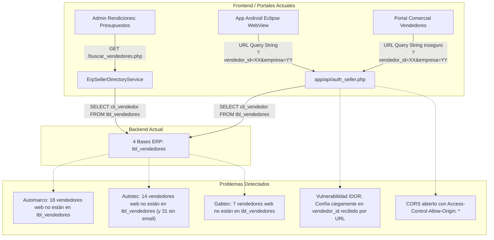
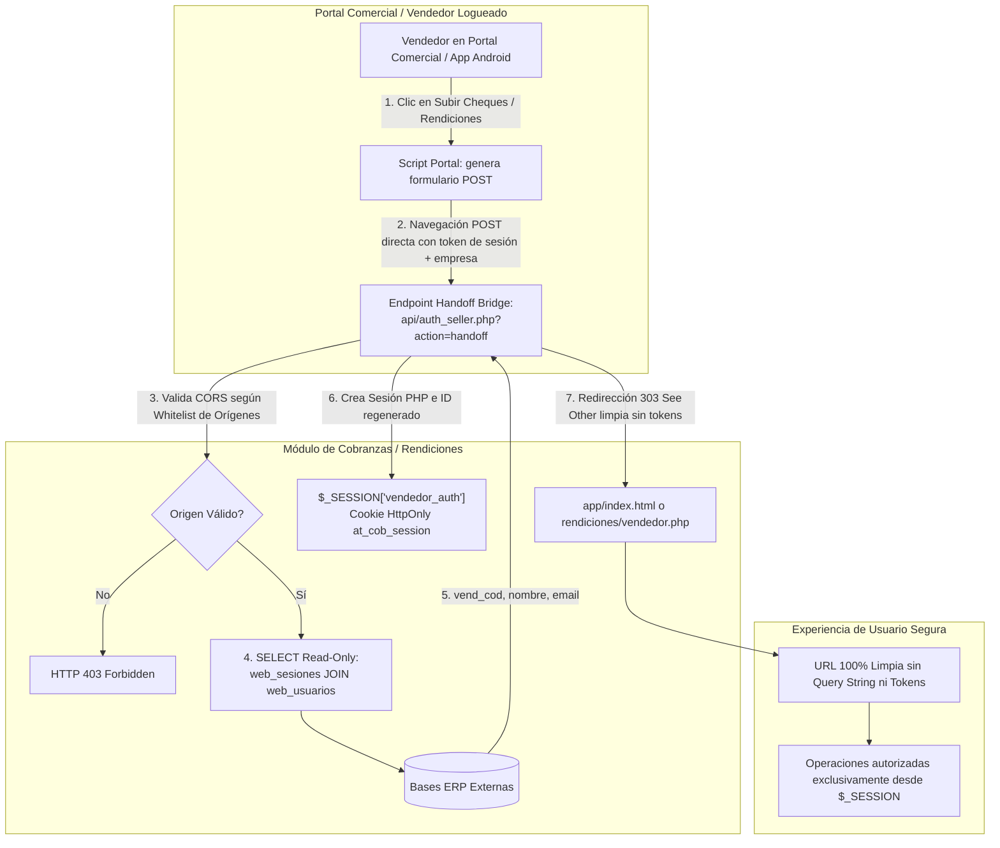

# Plan de Implementación — `web_usuarios` como Fuente Read-Only de Vendedores (Revisado)

Este documento detalla la arquitectura, el diseño de seguridad, las consultas SQL de solo lectura, la estrategia de handoff sin tokens en URL y el protocolo de pruebas para adoptar `web_usuarios.vend_cod` como fuente autorizada de vendedores activos en **Automarco**, **Autotec** y **Gabtec**, manteniendo la integración histórica de **Automarco HD** mediante `tbl_vendedores`.

> [!IMPORTANT]
> **REGLA ABSOLUTA — BASES EXTERNAS ESTRICTAMENTE READ-ONLY:**
> Las 4 bases de datos ERP (`automarc_automarco`, `autohd_automarcohd`, `autotec_ecom`, `gabteccl_sitbdd1978`) permanecerán **100% de solo lectura**.
> Queda terminantemente prohibido ejecutar o incorporar sentencias `INSERT`, `UPDATE`, `DELETE`, `REPLACE`, `ALTER`, `CREATE`, `DROP`, `TRUNCATE`, procedimientos de escritura, o cualquier mutación sobre `web_usuarios`, `web_sesiones` o `ultimo_login`.
> Toda prueba, doble de prueba o fixture se ejecutará **sin tocar jamás las bases ERP**.
> La **ÚNICA** base de datos modificable por este sistema es la central del proyecto: `bd_modulo_cobranzas`.

---

## 1. Flujo Actual



1. **Catálogo de Vendedores:** [`services/ErpSellerDirectoryService.php`](file:///c:/laragon/www/form/services/ErpSellerDirectoryService.php) consulta exclusivamente `tbl_vendedores` en las cuatro empresas mediante `cli_vendedor`, `nombre_vendedor` y `ven_mail`.
2. **Descalce Operativo:** 39 vendedores web legítimos (18 en Automarco, 14 en Autotec y 7 en Gabtec) no existen en `tbl_vendedores` y por ende no pueden seleccionarse para presupuestos ni rendiciones.
3. **Autenticación Vendedor:** [`api/auth_seller.php`](file:///c:/laragon/www/form/api/auth_seller.php) recibe `vendedor_id` y `empresa` por parámetro HTTP (`GET` o `POST`), consulta `tbl_vendedores`, permite CORS abierto (`*`) y sintetiza correos falsos si no existen.
4. **Handoff Inseguro:** El botón de recaudación en los portales comerciales (`dist/cheques_cobranza/vendedores/pages/cobranza.html`) redirige concatenando en la URL `?vendedor_id=${currentVendCod}&empresa=${currentEmpresaCod}&vendedor_nombre=${currentVendNombre}`.

---

## 2. Riesgos Actuales

| Riesgo | Severidad | Impacto |
|---|---|---|
| **Bloqueo Operacional de Vendedores** | **Alto** | 39 vendedores activos en terreno no pueden rendir gastos ni recibir asignaciones presupuestarias porque el sistema no los encuentra en `tbl_vendedores`. |
| **Suplantación de Identidad (IDOR / Spoofing)** | **Crítico** | Al confiar en `vendedor_id` pasado por parámetro URL en `auth_seller.php`, cualquier usuario o script puede alterar el query string y operar en nombre de otro vendedor. |
| **Fuga de Credenciales en URL (Logs, Historial, Referer)** | **Crítico** | Pasar tickets o identificadores por query string (`?ticket=...`) deja rastros en logs de servidores web, proxies, historial de navegación y cabeceras HTTP `Referer`. |
| **CORS Indiscriminado (`*`)** | **Alto** | `auth_seller.php` permite cualquier origen mediante `Access-Control-Allow-Origin: *`, posibilitando ataques cross-origin desde dominios no autorizados. |
| **Inconsistencia de Correo** | **Medio** | En Autotec, el 100% de los vendedores de `web_usuarios` (31 registros) tienen `email IS NULL`. Exigir correo o inventar correos ficticios genera fallas o envíos espurios. |
| **Ambigüedad por Duplicados** | **Medio** | Si una base ERP contiene múltiples registros con el mismo `vend_cod` activo, un `SELECT ... LIMIT 1` seleccionaría arbitrariamente al primero sin advertir la colisión. |
| **Fuga de Datos Sensibles** | **Alto** | `web_usuarios` contiene hashes de contraseñas (`password`) y Gabtec tiene columnas internas (`cla_ids_bloqueados`, `filtro_cliente_campo`) que nunca deben exponerse. |

---

## 3. Flujo Propuesto (Sin Tokens en URL y con CORS Estricto)



### Principios del Flujo Propuesto:
1. **Cero Tokens en URL (P0):** La transición desde el portal comercial hacia el módulo de cobranzas/rendiciones se realiza mediante una **navegación `POST`** (formulario autoenviado o navegación controlada con `target="_self"`), entregando la prueba de sesión en el cuerpo del request. El backend procesa el `POST`, establece la cookie de sesión del módulo (`HttpOnly`, `SameSite=Lax`) y responde con una **redirección HTTP 303** a una **URL completamente limpia** (`app/index.html` o `rendiciones/vendedor.php`) sin ningún parámetro, token ni ticket en el query string.
2. **Desactivación del Modo URL Legado en Producción (P0):**
   - En `APP_ENV = 'production'`, cualquier petición a `auth_seller.php` o páginas de la aplicación que pretenda autenticar mediante `?vendedor_id=...` o `?vendedor=...` en la URL es **rechazada inmediatamente con HTTP 401 Unauthorized**.
   - La aplicación Android Eclipse debe utilizar el handoff seguro por `POST` entregando la sesión autenticada.
   - El modo de prueba por URL queda confinado de forma estricta y exclusiva a `APP_ENV = 'local'` con advertencia en logs de auditoría.
3. **CORS con Whitelist Exacta (P1):**
   - Se elimina `Access-Control-Allow-Origin: *`.
   - Se implementa una función de validación de orígenes permitidos que compara contra una lista blanca fija:
     - `https://www.automarco.cl`
     - `https://automarco.cl`
     - `https://www.autotec.cl`
     - `https://autotec.cl`
     - `https://www.gabtec.cl`
     - `https://gabtec.cl`
     - En `APP_ENV = 'local'`, se admiten `http://localhost`, `http://127.0.0.1` y los dominios virtuales de Laragon (`*.test`, `*.local`).
4. **Verificación de Privilegios Read-Only sin `REVOKE` (P1):**
   - No se alteran ni revocan permisos del usuario MySQL existente en el servidor durante el despliegue para no afectar sistemas concurrentes.
   - Se provee una guía para que el DBA pueda asignar una credencial con permisos estrictos `GRANT SELECT` sobre las bases ERP.
5. **Pruebas sin Modificar ERP (P1):**
   - Ningún test insertará datos en `automarc_automarco`, `autotec_ecom`, `gabteccl_sitbdd1978` o `autohd_automarcohd`.
   - La simulación de vendedores duplicados, inactivos, con códigos no numéricos o roles distintos se realizará mediante **dobles de prueba en memoria (Mocks)** y **tablas temporales en `bd_modulo_cobranzas`**.
6. **Nombre de Migración Único (P2):**
   - La nueva migración se nombrará: `config/migrations/2026_09_04_02_vendedor_handoff_tokens.sql`.
7. **Política de Tokens con Zero Delete (P2):**
   - La tabla técnica `vendedor_handoff_tokens` conserva `usado_at`, `expira_at` y auditoría completa. No se realizan sentencias `DELETE` automáticas. Si a futuro se autoriza una purga cronológica de tickets expirados, se implementará bajo una política independiente debidamente documentada.

---

## 4. Archivos Exactos a Modificar y Crear

### Archivos Nuevos
1. `config/migrations/2026_09_04_02_vendedor_handoff_tokens.sql`: Migración aditiva e idempotente para la tabla de registro de handoffs en `bd_modulo_cobranzas`.
2. `scratch/preflight_seller_directory.php`: Script local de diagnóstico de solo lectura que ejecuta exclusivamente sentencias `SELECT` de conteo agregado, con guard que aborta si detecta sentencias DDL/DML.
3. `scratch/test_seller_directory.php`: Suite automatizada de pruebas del directorio de vendedores (con dobles de prueba sin escrituras ERP).
4. `scratch/test_seller_handoff.php`: Suite automatizada de pruebas del handoff seguro por `POST` y validación de sesiones.

### Archivos Modificados (Root y Réplica 1:1 en `dist/cheques_cobranza/app/`)
1. [`services/ErpSellerDirectoryService.php`](file:///c:/laragon/www/form/services/ErpSellerDirectoryService.php): Refactorización con mapa cerrado de fuentes, validación de `vend_cod` numérico, detección de ambigüedad por duplicados y soporte de interfaz/repositorio inyectable para pruebas.
2. [`api/auth_seller.php`](file:///c:/laragon/www/form/api/auth_seller.php):
   - Reemplazo de `Access-Control-Allow-Origin: *` por whitelist exacta.
   - Endpoint de handoff por `POST` (`action=handoff`) con redirección 303 a URL limpia.
   - Desactivación total del bypass de autenticación por URL en producción (`APP_ENV === 'production'`).
3. [`config/auth.php`](file:///c:/laragon/www/form/config/auth.php):
   - Inclusión de la función `validateAllowedOrigin(): ?string`.
   - Ajuste de `requireSellerContext()` para validar identidad `(empresa_id, vendedor_id)` con correo opcional (`null` permitido).
4. [`admin/api/rendiciones/buscar_vendedores.php`](file:///c:/laragon/www/form/admin/api/rendiciones/buscar_vendedores.php): Consumo del nuevo servicio con metadata de fuente de identidad.
5. [`admin/api/rendiciones/gestion_presupuestos.php`](file:///c:/laragon/www/form/admin/api/rendiciones/gestion_presupuestos.php): Validación estricta que reconsulta `ErpSellerDirectoryService`, ignora nombre/correo del request y admite correo nulo.
6. [`admin/js/rendiciones.js`](file:///c:/laragon/www/form/admin/js/rendiciones.js): Adaptación visual para indicar si el vendedor proviene de `web_usuarios` o `tbl_vendedores_legacy`, soportando "Sin correo válido".
7. [`api/get_clientes.php`](file:///c:/laragon/www/form/api/get_clientes.php): Eliminación definitiva de parámetros `vendedor_id` por GET/POST; identidad extraída obligatoriamente desde `$_SESSION['vendedor_auth']`.
8. [`api/get_facturas_cliente.php`](file:///c:/laragon/www/form/api/get_facturas_cliente.php): Identidad obligatoria desde `$_SESSION['vendedor_auth']`.
9. [`api/guardar_cobranza.php`](file:///c:/laragon/www/form/api/guardar_cobranza.php): Identidad obligatoria desde `$_SESSION['vendedor_auth']`.
10. [`dist/cheques_cobranza/vendedores/pages/cobranza.html`](file:///c:/laragon/www/form/dist/cheques_cobranza/vendedores/pages/cobranza.html) y [`dist/cheques_cobranza/vendedores_DEV/pages/cobranza.html`](file:///c:/laragon/www/form/dist/cheques_cobranza/vendedores_DEV/pages/cobranza.html): Reemplazo de la redirección con query string por navegación `POST` autoenviada hacia `api/auth_seller.php`.
11. [`config/setup.sql`](file:///c:/laragon/www/form/config/setup.sql): Inclusión de la tabla `vendedor_handoff_tokens`.
12. [`scripts/verify_release.php`](file:///c:/laragon/www/form/scripts/verify_release.php): Verificación de contratos estáticos y paridad SHA-256.

---

## 5. Consultas SELECT Propuestas

Todas las consultas utilizan parámetros nombrados y `ALLOWED_DATABASES`:

### A. Búsqueda y Listado en `web_usuarios` (Automarco, Autotec, Gabtec)
```sql
SELECT 
    CAST(vend_cod AS UNSIGNED) AS vendedor_id,
    nombre AS vendedor_nombre,
    NULLIF(TRIM(email), '') AS vendedor_email
FROM `{nombre_bd}`.web_usuarios
WHERE rol = :rol
  AND activo = :activo
  AND vend_cod IS NOT NULL
  AND TRIM(vend_cod) <> ''
  AND (
      CAST(vend_cod AS CHAR) LIKE :busqueda_codigo
      OR nombre LIKE :busqueda_nombre
      OR (email IS NOT NULL AND email LIKE :busqueda_email)
  )
ORDER BY nombre ASC, vendedor_id ASC
LIMIT 100
```
*Parámetros:* `[':rol' => 'vendedor', ':activo' => 1, ':busqueda_codigo' => $patron, ':busqueda_nombre' => $patron, ':busqueda_email' => $patron]`

### B. Búsqueda Exacta por `vend_cod` en `web_usuarios` (Detección de Ambigüedad)
```sql
SELECT 
    CAST(vend_cod AS UNSIGNED) AS vendedor_id,
    nombre AS vendedor_nombre,
    NULLIF(TRIM(email), '') AS vendedor_email
FROM `{nombre_bd}`.web_usuarios
WHERE rol = :rol
  AND activo = :activo
  AND vend_cod = :vend_cod
```
*Lógica PHP:* Se ejecuta la consulta sin `LIMIT 1`.
- Si devuelve más de 1 fila: lanza `DomainException("Identidad de vendedor ambigua: existen múltiples cuentas activas con el código {$vendCod} en la empresa.")`.
- Si devuelve 1 fila: retorna el vendedor normalizado.
- Si devuelve 0 filas: retorna `null`.

### C. Búsqueda en Automarco HD (`tbl_vendedores` - Legacy)
```sql
SELECT 
    cli_vendedor AS vendedor_id,
    nombre_vendedor,
    NULLIF(TRIM(ven_mail), '') AS vendedor_email
FROM `autohd_automarcohd`.tbl_vendedores
WHERE cli_vendedor = :vendedor_id
LIMIT 1;
```

### D. Verificación Read-Only de Sesión para Handoff (`web_sesiones JOIN web_usuarios`)
```sql
SELECT 
    u.id AS web_usuario_id,
    u.vend_cod,
    u.nombre AS vendedor_nombre,
    NULLIF(TRIM(u.email), '') AS vendedor_email,
    u.rol,
    u.activo,
    s.expira_en
FROM `{nombre_bd}`.web_sesiones s
JOIN `{nombre_bd}`.web_usuarios u ON u.id = s.usuario_id
WHERE s.token = :session_token
  AND s.expira_en > NOW()
  AND u.activo = :activo
  AND u.rol = :rol
LIMIT 1
```
*Parámetros:* `[':session_token' => $token, ':activo' => 1, ':rol' => 'vendedor']`.

---

## 6. Estrategia de Autenticación y Handoff (Seguro y sin Tokens en URL)

### 6.1 Whitelist de Orígenes CORS
En `config/auth.php`:
```php
function getAllowedOrigins(): array {
    if (defined('APP_ENV') && APP_ENV === 'local') {
        return [
            'http://localhost',
            'http://127.0.0.1',
            'http://form.test',
            'http://autotec.test',
            'http://automarco.test',
            'http://gabtec.test'
        ];
    }
    return [
        'https://www.automarco.cl',
        'https://automarco.cl',
        'https://www.autotec.cl',
        'https://autotec.cl',
        'https://www.gabtec.cl',
        'https://gabtec.cl'
    ];
}

function handleCorsHeaders(): void {
    $origin = $_SERVER['HTTP_ORIGIN'] ?? '';
    $allowed = getAllowedOrigins();
    if (in_array($origin, $allowed, true)) {
        header("Access-Control-Allow-Origin: {$origin}");
        header('Access-Control-Allow-Credentials: true');
        header('Access-Control-Allow-Methods: POST, OPTIONS');
        header('Access-Control-Allow-Headers: Content-Type, X-Requested-With');
    }
    if ($_SERVER['REQUEST_METHOD'] === 'OPTIONS') {
        http_response_code(204);
        exit;
    }
}
```

### 6.2 Navegación POST para el Handoff
En lugar de viajar por `index.html?ticket=...`:
1. El portal de vendedores (`vendedores/pages/cobranza.html`) ejecuta:
   ```javascript
   function irARecaudacionCheques() {
       const sessionToken = authToken || '';
       const empresaCod = currentEmpresaCod || detectarEmpresaPorHost();
       if (!sessionToken) {
           showToast('No se detectó una sesión activa', 'error');
           return;
       }
       // Crear formulario temporal invisible en el DOM
       const form = document.createElement('form');
       form.method = 'POST';
       form.action = `${COBRANZAS_APP_URL}/api/auth_seller.php?action=handoff`;
       form.style.display = 'none';

       const inputToken = document.createElement('input');
       inputToken.name = 'session_token';
       inputToken.value = sessionToken;
       form.appendChild(inputToken);

       const inputEmpresa = document.createElement('input');
       inputEmpresa.name = 'empresa';
       inputEmpresa.value = empresaCod;
       form.appendChild(inputEmpresa);

       document.body.appendChild(form);
       form.submit();
   }
   ```
2. **Procesamiento en `api/auth_seller.php`:**
   - Valida el origen del request con `handleCorsHeaders()`.
   - Lee `$_POST['session_token']` y `$_POST['empresa']`.
   - Consulta de solo lectura en la BD ERP (`web_sesiones JOIN web_usuarios`).
   - Valida que `rol = 'vendedor'`, `activo = 1`, `vend_cod` numérico y no duplicado.
   - En `bd_modulo_cobranzas`, registra la auditoría del handoff en `vendedor_handoff_tokens` (`token_hash = hash('sha256', $sessionToken)`, `usado_at = NOW()`).
   - Inicia sesión PHP (`startSellerSession()`), ejecuta `session_regenerate_id(true)`, emite cookie de sesión `HttpOnly` y `SameSite=Lax`.
   - Asigna `$_SESSION['vendedor_auth']` con los datos oficiales de la base ERP.
   - Responde inmediatamente con una **redirección HTTP 303 (See Other)** hacia la URL limpia:
     ```php
     header('Location: ' . PORTAL_BASE_URL . '/index.html', true, 303);
     exit;
     ```
   - **Resultado:** El navegador aterriza en `/index.html` con la cookie de sesión ya activa, sin query string, sin tickets en la barra de direcciones, sin registro en logs de acceso y sin exposición en cabecera `Referer`.

### 6.3 Desactivación del Modo URL en Producción
En `api/auth_seller.php`:
```php
if (isset($_GET['vendedor_id']) || isset($_GET['vendedor'])) {
    if (defined('APP_ENV') && APP_ENV === 'production') {
        http_response_code(401);
        echo json_encode([
            'success' => false,
            'message' => 'Autenticación por URL no permitida en entorno de producción.'
        ]);
        exit;
    }
    // En local, se permite únicamente para pruebas unitarias con advertencia
    error_log('[SECURITY WARNING] Acceso de prueba por URL permitido solo en entorno local.');
}
```

---

## 7. Estrategia Automarco HD

- **Naturaleza:** `autohd_automarcohd` es una empresa que no opera comercialmente en la web (no posee `web_usuarios`).
- **Comportamiento:**
  - Se mantiene en `ALLOWED_DATABASES` y en la tabla central `empresas` (ID 2).
  - En `ErpSellerDirectoryService`, las consultas para HD se dirigen a `autohd_automarcohd.tbl_vendedores`.
  - El contrato normalizado devuelve `"fuente_identidad": "tbl_vendedores_legacy"`.
  - Todas las cobranzas históricas, facturas y presupuestos de HD permanecen intactos y consultables en el panel administrativo.
  - No se crean tablas ni se insertan datos en `autohd_automarcohd`.

---

## 8. Cambios Necesarios en `bd_modulo_cobranzas`

La única modificación de base de datos se realiza sobre `bd_modulo_cobranzas` mediante una migración aditiva, idempotente y con Zero Delete:

### Archivo: `config/migrations/2026_09_04_02_vendedor_handoff_tokens.sql`
```sql
USE `bd_modulo_cobranzas`;

CREATE TABLE IF NOT EXISTS `vendedor_handoff_tokens` (
  `id` INT AUTO_INCREMENT PRIMARY KEY,
  `token_hash` CHAR(64) NOT NULL COMMENT 'SHA-256 de la prueba de sesion utilizada en el handoff',
  `empresa_id` INT NOT NULL,
  `vendedor_id` BIGINT NOT NULL COMMENT 'Codigo vend_cod normalizado del ERP',
  `vendedor_nombre` VARCHAR(150) NULL,
  `vendedor_email` VARCHAR(150) NULL,
  `expira_at` DATETIME NOT NULL,
  `usado_at` DATETIME NULL,
  `created_at` TIMESTAMP DEFAULT CURRENT_TIMESTAMP,
  UNIQUE KEY `uq_vendedor_handoff_hash` (`token_hash`),
  KEY `idx_vendedor_handoff_lookup` (`token_hash`, `usado_at`, `expira_at`),
  CONSTRAINT `fk_handoff_empresa` FOREIGN KEY (`empresa_id`) REFERENCES `empresas` (`id`) ON DELETE RESTRICT
) ENGINE=InnoDB DEFAULT CHARSET=utf8mb4 COLLATE=utf8mb4_unicode_ci;
```

- Se sincroniza idénticamente en `config/setup.sql`.
- **Aclaración:** Esta migración se probará localmente en bases temporales pero **NO se ejecutará en el servidor de producción** durante esta tarea.
- **Política Zero Delete:** Los registros no se borran físicamente. Si en el futuro se define una política formal de depuración cronológica para esta tabla técnica, se documentará de forma separada.

---

## 9. Confirmación de CERO Escrituras en las Cuatro Bases Externas

Se garantiza formalmente que:
1. `automarc_automarco` **NO** recibirá ningún `INSERT`, `UPDATE`, `DELETE`, `ALTER` ni `DROP`.
2. `autohd_automarcohd` **NO** recibirá ningún `INSERT`, `UPDATE`, `DELETE`, `ALTER` ni `DROP`.
3. `autotec_ecom` **NO** recibirá ningún `INSERT`, `UPDATE`, `DELETE`, `ALTER` ni `DROP`.
4. `gabteccl_sitbdd1978` **NO** recibirá ningún `INSERT`, `UPDATE`, `DELETE`, `ALTER` ni `DROP`.
5. No se escribirán registros en `web_usuarios`, no se crearán registros en `web_sesiones` y no se actualizará `ultimo_login`.
6. Todas las pruebas automatizadas auditarán que el 100% de las consultas dirigidas a las conexiones ERP corresponden a `SELECT`.

---

## 10. Matriz de Pruebas (Con Dobles de Prueba y CERO Escrituras ERP)

Para probar casos extremos (vendedor duplicado, inactivo, rol no vendedor, código no numérico) **sin tocar las bases ERP**, se utilizará un repositorio inyectable o conexión simulada en memoria/BD temporal central:

| N° | Prueba | Estrategia de Aislamiento | Criterio de Éxito |
|---|---|---|---|
| 1 | Automarco consulta `web_usuarios` | Conexión real ERP read-only | Devuelve los 33 vendedores activos con `vend_cod` numérico. |
| 2 | Autotec consulta `web_usuarios` sin email | Conexión real ERP read-only | Devuelve los 31 vendedores activos con `vendedor_email = null`. |
| 3 | Gabtec consulta `web_usuarios` | Conexión real ERP read-only | Devuelve los 20 vendedores activos sin exponer campos internos. |
| 4 | HD consulta `tbl_vendedores` | Conexión real ERP read-only | Devuelve vendedores desde `tbl_vendedores` con fuente `tbl_vendedores_legacy`. |
| 5 | Filtro de rol estricto | Doble de prueba / Mock | Cuentas con `rol = 'cliente'` o `rol = 'admin'` son excluidas. |
| 6 | Filtro de activo estricto | Doble de prueba / Mock | Cuentas con `activo = 0` son excluidas. |
| 7 | Código vacío o no numérico | Doble de prueba / Mock | Registros con `vend_cod IS NULL`, vacío o con letras son excluidos. |
| 8 | Detección de duplicidad | Doble de prueba / Mock | Simulación de 2 registros activos con mismo `vend_cod` lanza `DomainException` y responde HTTP 409 controlado. |
| 9 | `web_usuarios.id` nunca usado como código | Conexión real ERP read-only | Comprobado que `vendedor_id` equivale a `vend_cod` y no a `id`. |
| 10 | Aislamiento cross-empresa | Conexión real ERP read-only | Mismo `vend_cod` en Automarco y Autotec se resuelve como dos identidades distintas. |
| 11 | Sanitización de input en presupuesto | BD central temporal con ROLLBACK | Datos de nombre/email manipulados en el frontend son ignorados por el backend. |
| 12 | Handoff con sesión válida por POST | Doble de prueba / BD temporal | Formulario POST genera sesión PHP y redirige con HTTP 303 a URL limpia. |
| 13 | Handoff con sesión vencida | Doble de prueba / Mock | Token con `expira_en < NOW()` es rechazado con HTTP 401. |
| 14 | Handoff con token de otra empresa | Doble de prueba / Mock | Token inexistente en la BD de la empresa seleccionada es rechazado con HTTP 401. |
| 15 | Handoff con usuario no vendedor | Doble de prueba / Mock | Token de usuario con rol `cliente` o `admin` es rechazado con HTTP 403. |
| 16 | Vendedor sin email | Conexión real Autotec | Vendedor de Autotec sin email completa handoff, presupuesto y rendición sin errores. |
| 17 | Presupuesto mensual | BD central temporal con ROLLBACK | Creación y actualización de presupuesto mensual funciona con vendedor de `web_usuarios`. |
| 18 | Gira comercial | BD central temporal con ROLLBACK | Creación y aprobación de gira funciona con vendedor de `web_usuarios`. |
| 19 | Flujo de Rendiciones | BD central temporal con ROLLBACK | Consolidación y validación documental funciona sin requerir email de vendedor. |
| 20 | Cobranza de cheques | BD central temporal con ROLLBACK | Registro de cobranza y asignación de facturas funciona con vendedor de `web_usuarios`. |
| 21 | Visibilidad histórica de HD | Conexión real read-only | Cobranzas y presupuestos históricos de HD continúan listándose en administración. |
| 22 | Cero escrituras externas | Verificador en proxy PDO | Confirmación verificable de que ninguna query de prueba ejecutó sentencias distintas a `SELECT` en ERPs. |
| 23 | Bloqueo de URL en producción | Simulación `APP_ENV=production` | Acceso con `?vendedor_id=...` responde HTTP 401. |
| 24 | Validación de CORS con whitelist | Simulación de cabecera Origin | Origen no autorizado responde HTTP 403; origen de whitelist responde encabezados exactos. |
| 25 | Paridad 100% SHA-256 | `scripts/verify_release.php` | 100% de paridad root/dist certificada. |
| 26 | Cero fugas sensibles | Verificación estática de logs | Logs y respuestas JSON no contienen passwords, tokens ni trazas de error. |

---

## 11. Orden de Implementación Local

1. **Paso 1: Preflight Read-Only de Diagnóstico**
   - Crear `scratch/preflight_seller_directory.php` con verificación estricta de que solo ejecuta consultas `SELECT/SHOW/DESCRIBE/EXPLAIN` y reporta únicamente conteos agregados.
2. **Paso 2: Migración Central en `bd_modulo_cobranzas`**
   - Crear `config/migrations/2026_09_04_02_vendedor_handoff_tokens.sql` y sincronizar `config/setup.sql`.
   - Probar su aplicación e idempotencia en base temporal aislada.
3. **Paso 3: Refactorización de `services/ErpSellerDirectoryService.php`**
   - Implementar mapa cerrado de fuentes, validación numérica, detección de ambigüedad por duplicados y soporte de inyección para pruebas.
4. **Paso 4: Actualización de Endpoints de Presupuestos y Selector**
   - Actualizar `admin/api/rendiciones/buscar_vendedores.php`, `gestion_presupuestos.php` y `admin/js/rendiciones.js`.
5. **Paso 5: Implementación de Handoff Seguro en `api/auth_seller.php`**
   - CORS con whitelist exacta.
   - Manejo de navegación `POST` con redirección 303 a URL limpia.
   - Bloqueo total de parámetros URL en producción.
   - Actualización de `config/auth.php` (`requireSellerContext`).
6. **Paso 6: Aseguramiento de Identidad desde Sesión**
   - Blindar `api/get_clientes.php`, `api/get_facturas_cliente.php` y `api/guardar_cobranza.php` para exigir identidad desde `$_SESSION['vendedor_auth']`.
7. **Paso 7: Actualización de Portales Comerciales en `dist/`**
   - Adaptar `cobranza.html` en `vendedores` y `vendedores_DEV` para realizar la navegación `POST` hacia `api/auth_seller.php`.
8. **Paso 8: Batería de Pruebas Automatizadas**
   - Ejecutar `scratch/preflight_seller_directory.php`, `scratch/test_seller_directory.php`, `scratch/test_seller_handoff.php`, `scripts/test_rendiciones.php`, `scripts/test_approval_workflow.php` y `scratch/test_clean_setup.php`.
9. **Paso 9: Sincronización y Paridad Root/Dist**
   - Replicar cambios a `dist/cheques_cobranza/app/` y certificar con `php scripts/verify_release.php`.
10. **Paso 10: Actualización de Documentación Oficial**
    - Actualizar los 8 documentos markdown requeridos.

---

## 12. Orden Futuro de Preproducción (Guía para el DBA)

1. Respaldo íntegro previo de `bd_modulo_cobranzas` (`mysqldump`).
2. **Verificación de Privilegios (Sin ejecutar `REVOKE`):**
   - Verificar los privilegios del usuario de base de datos actual.
   - *Recomendación para el DBA:* Asignar una credencial de base de datos dedicada para el módulo de cobranzas/rendiciones que posea permisos completos sobre `bd_modulo_cobranzas` y permisos exclusivamente `SELECT` sobre las cuatro bases de datos ERP (`automarc_automarco`, `autohd_automarcohd`, `autotec_ecom`, `gabteccl_sitbdd1978`). No alterar los permisos del usuario compartido de los portales comerciales.
3. Aplicar migraciones centrales en orden secuencial según [`docs/CHECKLIST_MIGRACIONES_PRODUCCION.md`](file:///c:/laragon/www/form/docs/CHECKLIST_MIGRACIONES_PRODUCCION.md).
4. Aplicar `2026_09_04_02_vendedor_handoff_tokens.sql` exclusivamente en `bd_modulo_cobranzas`.
5. Desplegar los archivos de la aplicación desde `dist/cheques_cobranza/app/`.
6. Desplegar los portales comerciales actualizados con el formulario `POST`.
7. Ejecutar smoke test de login y handoff por `POST` para cada una de las empresas.
8. Confirmar en los logs del servidor la ausencia de errores o intentos de escritura externa.
9. *Plan de Rollback:* En caso de imprevisto, restaurar los archivos anteriores y la base central `bd_modulo_cobranzas`. Las bases externas no requerirán rollback puesto que jamás son modificadas.

---

## 13. Riesgos y Decisiones de Negocio Pendientes

1. **Política de Cese Definitivo de Automarco HD:**
   - La implementación conserva HD operativo mediante `tbl_vendedores`.
   - *Decisión pendiente para el negocio:* Definir la fecha formal en que se bloqueará la creación de nuevos presupuestos para HD en el panel de administración.
2. **Actualización de la App Android Eclipse (WebView):**
   - La app Android nativa actualmente carga el WebView pasando parámetros URL.
   - En producción, el modo URL quedará bloqueado por seguridad. Se debe coordinar la actualización de la app Android para que invoque el endpoint de handoff por `POST` entregando el token de sesión obtenido durante su login.
3. **Retención de Tokens de Handoff (Zero Delete):**
   - La tabla `vendedor_handoff_tokens` conserva `usado_at`, `expira_at` y auditoría completa sin borrado físico (`Zero Delete`).
   - Si en el futuro el volumen de registros justifica una política de purga de tickets expirados de más de 30 o 60 días, se deberá aprobar como una política técnica separada.
